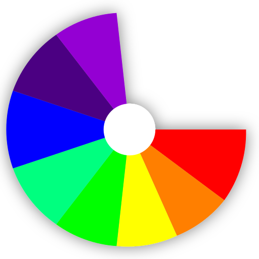

# Evil Spin
**Evil Spin** is a free, fun and open source App for spinning a wheel.
It objectivly looks **very pretty**. 

Or download here: [Releases Section](https://github.com/EVE-146T/EVILSPIN/releases/latest).
## Features

- Free and open source
- click spin button to spin the wheel
 - spin button has a changing color outline
- settings
 - change the appearance of the wheel
  - multiple color palettes supported:
    - Default (Ugly)
    - Pastell (Pretty)
  - Custom Wheel Title
  - Change Wheel speed!
  - change minimum wheel spin
  - change the background of the main view:
    - Ravenous Red 🔴
    - Opal Orange 🟠
    - Yust Yellow 🟡
    - Lime 
    - grass green 🍏
    - Turkish Turkise 
    - Whale Blue 🔵
    - Indigo
    - Prone Purple
    - boring gray
  - Import your Wheel!
    - plain text file, new line for new slice
  - Export your Wheel!
  - Reset the wheel :(
  - Set the wheel to a default example
  - Save/Cancel the setting setting process
- cool icon with transparency

## Screenshots

## License

This project is licensed under the GNU General Public License v2.0. See the [LICENSE](LICENSE.licensetextfile) file for details.

